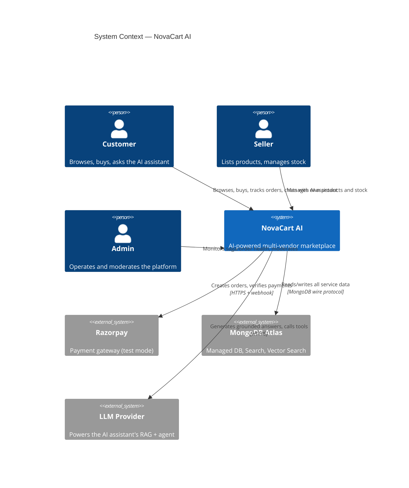

# NovaCart AI

**The Future of Intelligent Shopping**

A cloud-native, event-driven, AI-powered e-commerce platform built on Service-Oriented Architecture and microservices — where an AI agent grounded in real catalogue and policy data can search, compare, recommend, and act on a customer's behalf.

Built as a 4-person team project, each member independently owning a vertical slice of the system (see [Team & Ownership](#team--ownership)).

## Team Members

| Roll Number | Name |
|---|---|
| 2410030208 | N Hemanth Babu (Lead) |
| 2410030048 | Alok Kumar Singh |
| 2410030110 | Smruti Ranjan Parhi |
| 2410030114 | Arjun |

---

## What makes this worth looking at

Three things this project is actually trying to prove, not just describe:

1. **Real event-driven consistency** — the order flow is a genuine Saga with compensating transactions and a transactional outbox, not just "service A calls service B."
2. **Grounded RAG that provably doesn't hallucinate** — retrieval-augmented answers with citations and a measured eval harness, not a vibes-based claim.
3. **A tool-calling AI agent with a real permission model** — the agent can *act* (cancel an order, check stock), fenced against prompt injection and privilege escalation, with every write confirmed before it executes.

## Status

This is being built phase-by-phase, not all at once — see [`docs/PROGRESS.md`](docs/PROGRESS.md) for the live, authoritative status. As of the last update:

| Area | Status |
|---|---|
| Requirements, architecture, database design, design system | ✅ Done |
| Frontend shell (routing, theme, auth, all pages scaffolded) | ✅ Done |
| Platform infra — Eureka, Config Server, API Gateway | ✅ Done |
| Auth service — register/login/refresh/logout/reset, RS256 JWT, rate limiting | ✅ Done |
| Product, Inventory, Cart, Order, Payment, Kafka saga, AI Assistant | 🚧 Not started |
| Docker, CI/CD, cloud deployment | 🚧 Not started / deferred |

Scope for the services not yet listed above was deliberately trimmed for a realistic build timeline — see [`docs/DEFERRED.md`](docs/DEFERRED.md) and [ADR-001](docs/DECISIONS.md) for exactly what and why.

## Architecture

Full detail, C4 diagrams, service boundary reasoning, and the saga sequence diagram live in [`docs/ARCHITECTURE.md`](docs/ARCHITECTURE.md). High-level system context:



## Tech Stack

| Layer | Stack |
|---|---|
| Backend | Java 21, Spring Boot 3.3.13, Spring Cloud 2023.0.6, Spring Security, Spring Data MongoDB, Maven (multi-module, wrapper committed) |
| Frontend | React 18, TypeScript 5, Vite, Tailwind CSS 3, React Router 6, TanStack Query 5, Zustand, Framer Motion, react-hook-form + Zod |
| Data | MongoDB (Atlas in production, local Docker for dev), Redis |
| Infra | Eureka (discovery), Spring Cloud Config (centralized config, native/filesystem-backed), Spring Cloud Gateway (edge) |
| Auth | RS256 JWT, opaque hashed refresh tokens with rotation + reuse detection, BCrypt-12 |
| Planned, not yet built | Apache Kafka (saga backbone), Razorpay (payments), an LLM provider (AI assistant), Docker Compose, CI/CD |

## Repository Structure

```
novacart-ai/
├── docs/                    # requirements, architecture, database design, decisions, progress
├── infra/
│   ├── eureka-server/
│   ├── config-server/
│   └── api-gateway/
├── services/
│   └── auth-service/        # the only business service built so far
├── shared/
│   └── novacart-common/     # event envelope + API response DTOs only, no business logic
├── frontend/
│   └── novacart-web/
├── keys/                    # gitignored — RS256 JWT keypair, generate your own (see below)
├── pom.xml                  # Maven multi-module parent
├── mvnw / mvnw.cmd          # Maven Wrapper — no system-wide Maven install needed
└── .env.example
```

## Getting Started

**Prerequisites:** JDK 21, Docker, Node.js 18+.

**1. Generate a JWT keypair** (gitignored — every clone needs its own):
```bash
mkdir keys
openssl genpkey -algorithm RSA -pkeyopt rsa_keygen_bits:2048 -out keys/jwt-private-key.pem
openssl rsa -pubout -in keys/jwt-private-key.pem -out keys/jwt-public-key.pem
```

**2. Start MongoDB and Redis:**
```bash
docker run -d --name novacart-mongo -p 27017:27017 mongo:7
docker run -d --name novacart-redis -p 6379:6379 redis:7-alpine
```

**3. Build everything:**
```bash
./mvnw clean install
```

**4. Start the backend, in order** (each needs the previous one healthy):
```bash
export JWT_PRIVATE_KEY_PATH=/absolute/path/to/keys/jwt-private-key.pem
export JWT_PUBLIC_KEY_PATH=/absolute/path/to/keys/jwt-public-key.pem

java -jar infra/eureka-server/target/eureka-server-0.1.0-SNAPSHOT.jar &     # :8761
java -jar infra/config-server/target/config-server-0.1.0-SNAPSHOT.jar &    # :8888
java -jar infra/api-gateway/target/api-gateway-0.1.0-SNAPSHOT.jar &        # :8080
java -jar services/auth-service/target/auth-service-0.1.0-SNAPSHOT.jar &   # :8081
```

**5. Start the frontend:**
```bash
cd frontend/novacart-web
npm install
npm run dev   # :5173
```

Eureka dashboard: `http://localhost:8761`. Everything routes through the Gateway at `http://localhost:8080/api/v1/*`.

### Port map

| Component | Port | Component | Port |
|---|---|---|---|
| Eureka Server | 8761 | Order Service | 8085 |
| Config Server | 8888 | Payment Service | 8086 |
| API Gateway | 8080 | Notification Service | 8087 |
| Auth Service | 8081 | Analytics Service | 8088 |
| Product Service | 8082 | AI Assistant Service | 8089 |
| Inventory Service | 8083 | Frontend (Vite dev) | 5173 |
| Cart Service | 8084 | MongoDB / Redis | 27017 / 6379 |

## Team & Ownership

4 members, each independently building a vertical slice — full breakdown, day estimates, and the phase-to-owner map in [`docs/TEAM.md`](docs/TEAM.md).

| Slice | Owns |
|---|---|
| Platform & Identity | Eureka, Config Server, Gateway, Auth service, app shell |
| Catalog & Discovery | Product service, Cart service |
| Transactions & Saga | Inventory, Order, Payment, Kafka saga, Notification |
| AI & Ops | AI Assistant (RAG + Agent), Analytics |

## Documentation

| Doc | What's in it |
|---|---|
| [`REQUIREMENTS.md`](docs/REQUIREMENTS.md) | Personas, user stories, NFRs, risk register |
| [`ARCHITECTURE.md`](docs/ARCHITECTURE.md) | C4 diagrams, service boundaries, sync/async matrix, the saga sequence diagram |
| [`DATABASE.md`](docs/DATABASE.md) | Per-service schemas, ER diagram, index plan, denormalization register |
| [`DESIGN_SYSTEM.md`](docs/DESIGN_SYSTEM.md) | Design tokens — color, type, spacing, motion |
| [`DECISIONS.md`](docs/DECISIONS.md) | ADRs — every non-obvious architectural call and why |
| [`PROGRESS.md`](docs/PROGRESS.md) | Live phase-by-phase status |
| [`DEFERRED.md`](docs/DEFERRED.md) | What's intentionally postponed, and why |
| [`TEAM.md`](docs/TEAM.md) | Team split, execution model, phase ownership |
