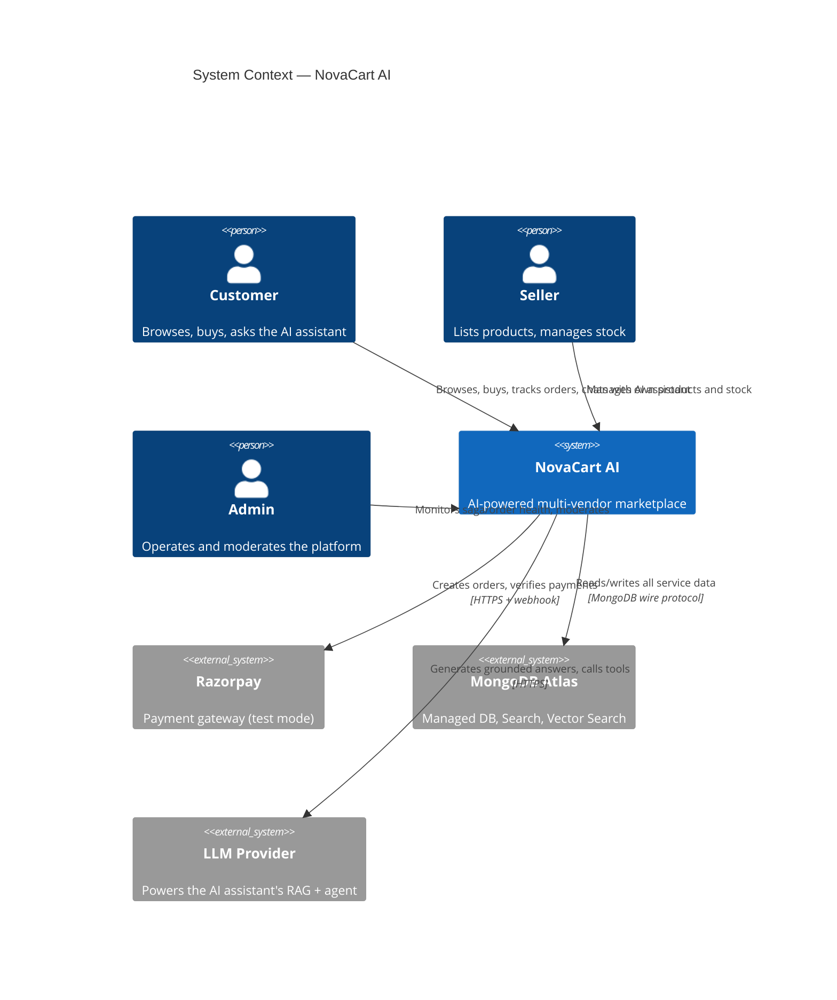
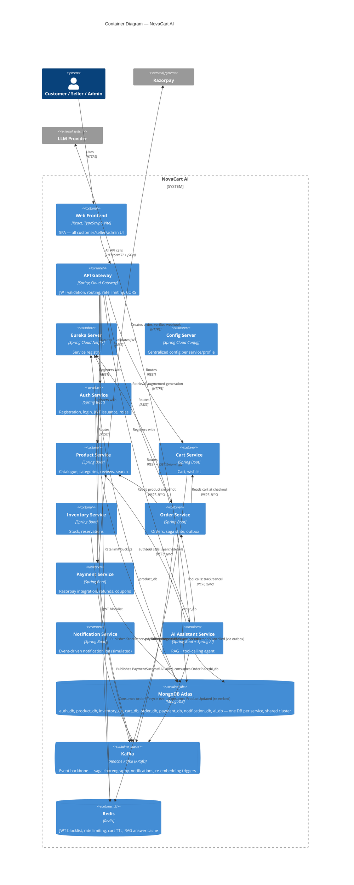
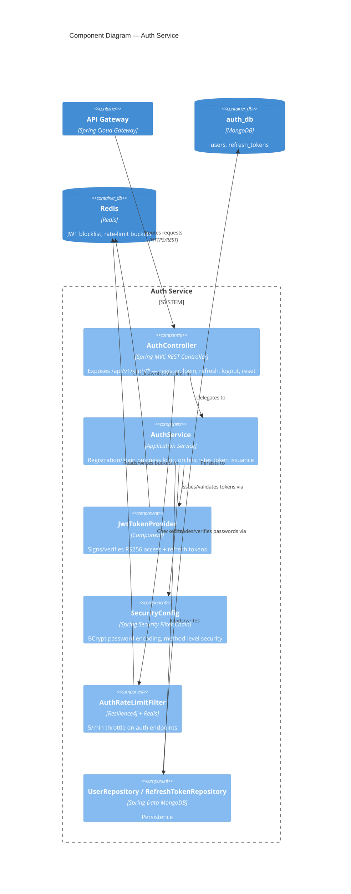
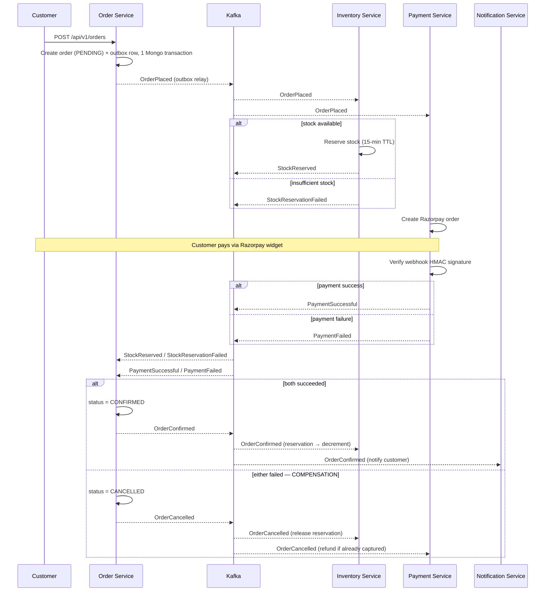

# NovaCart AI — Architecture

Phase 2 deliverable. This is the shared blueprint every member builds their slice against (see `TEAM.md`) — implementation is independently owned per ADR-003, but the boundaries, contracts, and event flow defined here are not.

## 1. System Context

## 2. Container Diagram

## 3. Component Diagram — Auth Service

Chosen as the component-level example because it's the first service being built (Member 1's slice). Other members are welcome to add their own service's component diagram here as they design it — same notation.

## 4. Service Boundary Justification

| Service | Owns | Why this boundary |
|---|---|---|
| Auth | Users, roles, refresh tokens | Identity is its own bounded context — every service trusts it, none should own it, which prevents duplicated/conflicting user records |
| Product | Catalogue, categories, reviews, embeddings | Catalogue data changes on a seller's schedule, independent of orders/inventory — natural boundary around "what can be bought" |
| Inventory | Stock levels, reservations | Stock correctness under concurrent writes is a distinct hard problem (optimistic locking, TTL reservations); isolating it stops Product and Order from fighting over the same write path |
| Cart | Carts, wishlists | Ephemeral, session-shaped data with different access patterns (Redis-backed) than durable order records |
| Order | Orders, order items, saga state | The transactional core — owns the saga because it's the aggregate root of the purchase lifecycle |
| Payment | Payments, refunds, coupons, invoices | Third-party integration (Razorpay) and payment-adjacent concerns are isolated so a provider swap never ripples into Order |
| Notification | Notification log, templates | Fan-out consumer of nearly every event; isolating it means a notification failure can never block a business transaction |
| Analytics | Read models, aggregates | Read-heavy, eventually-consistent by design — must never sit on the hot path of a write (deferred, see DEFERRED.md) |
| AI Assistant | Conversations, vector index, agent runs | Needs its own data lifecycle (embeddings, chat history) and its own cost/latency profile (LLM calls), distinct from transactional services |
| Workflow | Cross-service long-running processes | Reserved for orchestration that doesn't fit a single saga (deferred) |

## 5. Sync vs. Async Matrix

Default is async (Kafka) for state propagation and side effects; sync (REST) only where the caller needs an immediate answer and can degrade gracefully — every sync call wrapped in Resilience4j (3s timeout, 2 retries on idempotent GETs, circuit breaker).

| From → To | Type | Why |
|---|---|---|
| Frontend → Gateway → any service | Sync REST | User-facing request needs an immediate response |
| Order → Cart | Sync REST | Needs current cart contents at the instant of checkout |
| Order → Product | Sync REST | Needs current price/spec to snapshot into the order (denormalized, immutable after purchase) |
| AI Assistant → Product/Order/Inventory (tool calls) | Sync REST | Chat is a live conversation — tool results must return within the turn |
| Order → Kafka (`OrderPlaced`) | Async, via outbox | Triggers the saga — Inventory and Payment react independently, no direct coupling |
| Inventory → Kafka (`StockReserved` / `StockReservationFailed`) | Async | Order doesn't block waiting on stock; saga continues from the event |
| Payment → Kafka (`PaymentSuccessful` / `PaymentFailed`) | Async | Payment completion is driven by an external webhook, inherently async |
| Order → Kafka (`OrderConfirmed` / `OrderCancelled`) | Async | Fans out to Inventory (decrement/release), Notification, Analytics — none of which should block order finalization |
| Product → Kafka (`ProductUpdated`) | Async | Triggers AI re-embedding — a background concern, never on the product-edit request path |

## 6. The Order Saga (choreographed)

Choreography over central orchestration: each service reacts to events and publishes its own next event, with no single "saga orchestrator" service coordinating everyone. Chosen because the flow is a short chain (4-5 hops) where a dedicated orchestrator would just be another service to build, deploy, and fail — for a chain this size, choreography keeps each service's logic local and the failure modes are still traceable via `sagaHistory[]` on the order document. This is the diagram to know cold for an interview.

**Mechanics that make this safe, not just a nice diagram:**
- **Outbox pattern** (Order, Payment): domain write + outbox row in one Mongo transaction, a scheduled relay publishes to Kafka — eliminates the dual-write problem (what if the DB write succeeds but the Kafka publish doesn't?).
- **Inbox/dedupe**: every consumer stores processed `eventId`s (unique-indexed `processed_events` collection) — required because Kafka is at-least-once, so consumers must be idempotent.
- **Reservation TTL**: 15 minutes; a scheduled job releases expired reservations and cancels the order if payment never completes.
- **Deadline scope note**: per `REQUIREMENTS.md §7`, the compensation path being built and tested end-to-end for now is payment failure only. Stock-reservation-expiry and full DLT admin tooling are in `DEFERRED.md`.

## 7. Cloud Provider

See `DECISIONS.md` ADR-004. **Azure** (Container Apps + ACR + Key Vault), chosen primarily because the team's GitHub Student Developer Pack includes Azure credit without requiring a card on file — actual deployment execution stays deferred (`DEFERRED.md`) regardless.

## 8. Cross-Cutting Concerns (reference — see CLAUDE.md for full detail)

- **Security**: RS256 JWT (15-min access / 7-day refresh with rotation + reuse detection), gateway validates *and* every service re-verifies (defense in depth), BCrypt-12, Redis token-bucket rate limiting.
- **Observability**: Micrometer → Prometheus/Grafana, OpenTelemetry trace propagation across HTTP and Kafka, structured JSON logs with `traceId`/`correlationId` — full dashboards are a Tier 3 item, deferred, but `traceId` propagation itself is cheap to build in from Phase 6 onward and not worth retrofitting later.
- **Event envelope**: identical shape across every topic (`eventId`, `eventType`, `eventVersion`, `occurredAt`, `source`, `traceId`, `correlationId`, `payload`) — lives in `novacart-common`.
