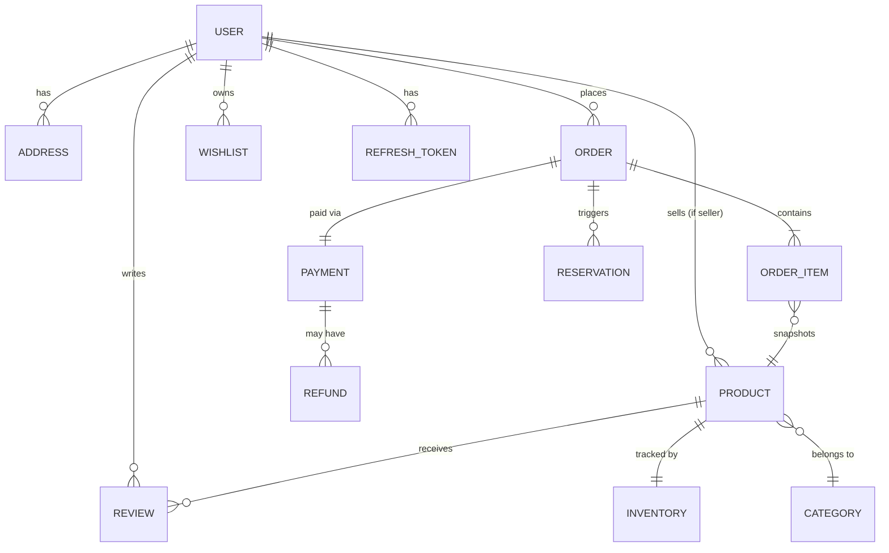

# NovaCart AI — Database Design

Phase 3 deliverable. MongoDB Atlas, one database per service on a shared cluster (see CLAUDE.md §6.1's honest note on this vs. true cluster isolation). Money is always stored as integer paise (`long`), never float. Every document has `_id`, `createdAt`, `updatedAt`; `version` (`@Version`) wherever optimistic locking matters (stock, cart-adjacent writes).

## Clarification: Cart storage

Active cart line-items live in **Redis only** (`cart:{userId|guestId}` → JSON, native TTL — 30d for guest sessions, refreshed on activity for logged-in users). **Wishlists live in Mongo** (`cart_db.wishlists`) since they're expected to persist indefinitely. This resolves an ambiguity between CLAUDE.md §4 (Redis for cart TTL) and §6.3 (Mongo cart indexes) — see `DECISIONS.md` if this needs to become a formal ADR later.

---

## auth_db (Member 1)

**`users`**
```
_id, email (unique, lowercase), passwordHash (BCrypt-12), fullName, phone?,
roles: ["ROLE_CUSTOMER" | "ROLE_SELLER" | "ROLE_ADMIN"],
addresses: [{ label, line1, line2, city, state, postalCode, country, isDefault }],  // embedded — bounded, always read with user
sellerProfile: { businessName, gstNumber, verified }?,  // embedded, present only if ROLE_SELLER
isActive, emailVerified, createdAt, updatedAt, version
```
Index: `{ email: 1 }` unique

**`refresh_tokens`** *(referenced, not embedded — unbounded per-device growth, independent TTL/revocation lifecycle)*
```
_id, userId (ref), tokenHash (never plaintext), familyId (rotation chain — reuse of a revoked token invalidates the whole family),
issuedAt, expiresAt, revoked, revokedAt?, replacedByTokenHash?, createdAt, updatedAt
```
Index: `{ tokenHash: 1 }` unique, `{ userId: 1 }`, TTL on `expiresAt`

**`password_reset_tokens`**
```
_id, userId (ref), tokenHash (unique), expiresAt (15 min), used, createdAt
```
Index: `{ tokenHash: 1 }` unique, TTL on `expiresAt`

---

## product_db (Member 2)

**`products`**
```
_id, slug (unique), sellerId (ref), name, description, brand,
categoryId (ref), categoryName (denormalized — see register below),
price (paise), currency: "INR", images: [url], specs: { key: value },
stockQuantity,  // Tier-1 naive stock — source of truth until Inventory service's reservations take over in Tier 2, not rewritten, migrated
ratingAvg, ratingCount,  // denormalized from reviews
tags: [string], isActive, createdAt, updatedAt, version
```
Index: `{ slug: 1 }` unique, `{ categoryId: 1, price: 1 }`, `{ sellerId: 1 }`, text index on `name`/`brand`/`description` (Tier-1 fallback search before/instead of Atlas Search — see DEFERRED.md)

**`categories`**
```
_id, name, slug (unique), parentId? (self-ref, hierarchy), imageUrl, isActive, createdAt, updatedAt
```
Index: `{ slug: 1 }` unique

**`reviews`** *(referenced — unbounded per product, independently paginated)*
```
_id, productId (ref), userId (ref), userName (snapshot — a review shouldn't change if the user renames),
rating (1-5), title, body, helpfulCount, createdAt, updatedAt
```
Index: `{ productId: 1, createdAt: -1 }`

---

## inventory_db (Member 3)

**`inventory`**
```
_id, productId (ref, unique), variantId? (reserved for future, null for now), sellerId (denormalized, seller-scoped queries),
availableQuantity, reservedQuantity, lowStockThreshold, createdAt, updatedAt, version  // optimistic lock — critical, concurrent reservations race here
```
Index: `{ productId: 1, variantId: 1 }` unique

**`reservations`**
```
_id, orderId (ref), productId (ref), quantity,
status: (ACTIVE | CONFIRMED | RELEASED | EXPIRED),
expiresAt (15 min from creation), createdAt, updatedAt
```
Index: `{ orderId: 1 }`, `{ expiresAt: 1 }` TTL, `{ status: 1, expiresAt: 1 }` (scheduled release job)

---

## cart_db (Member 2)

**`wishlists`** *(only collection here — see Cart storage clarification above)*
```
_id, userId (ref, unique), productIds: [ref], createdAt, updatedAt
```
Index: `{ userId: 1 }` unique

---

## order_db (Member 3)

**`orders`**
```
_id, orderNumber (unique, human-readable), userId (ref),
items: [{ productId, productName, productImage, sellerId, unitPrice, quantity, subtotal }],  // embedded — bounded, immutable snapshot at purchase time
shippingAddress: { ... },  // embedded snapshot from user's address at order time
subtotal, shippingFee, discount, tax, total (all paise), currency: "INR",
status: (PENDING | AWAITING_PAYMENT | CONFIRMED | CANCELLED | SHIPPED | DELIVERED),
sagaState, sagaHistory: [{ event, timestamp, details }],  // embedded audit trail
couponCode?, paymentId? (ref), idempotencyKey (unique — dedupes retried POSTs),
createdAt, updatedAt, version
```
Index: `{ userId: 1, createdAt: -1 }`, `{ status: 1 }`, `{ orderNumber: 1 }` unique, `{ idempotencyKey: 1 }` unique

**`outbox`**
```
_id, aggregateId (orderId), eventType, payload (full event envelope), published, createdAt, publishedAt?
```
Index: `{ published: 1, createdAt: 1 }`

**`processed_events`** *(inbox/dedupe)*
```
_id, eventId (unique), consumedAt
```
Index: `{ eventId: 1 }` unique, TTL 7d

---

## payment_db (Member 3)

**`payments`**
```
_id, orderId (ref), userId (ref), razorpayOrderId, razorpayPaymentId?,
amount (paise), currency, status: (CREATED | AUTHORIZED | CAPTURED | FAILED | REFUNDED),
idempotencyKey (unique), signatureVerified, webhookVerifiedAt?, createdAt, updatedAt
```
Index: `{ orderId: 1 }`, `{ idempotencyKey: 1 }` unique, `{ razorpayOrderId: 1 }`

**`refunds`**
```
_id, paymentId (ref), orderId (ref), amount, reason, status, razorpayRefundId, createdAt, updatedAt
```

**`coupons`**
```
_id, code (unique), type: (PERCENT | FIXED), value, minOrderValue, maxDiscount, validFrom, validTo, usageLimit, usedCount, isActive
```
Index: `{ code: 1 }` unique

**`invoices`**
```
_id, orderId (ref, unique), invoiceNumber (unique), issuedAt, amountsSnapshot: { ... }
```

---

## notification_db (Member 3 — logged-simulation stub, per DEFERRED.md)

**`notifications`**
```
_id, userId (ref), type (ORDER_CONFIRMED | ORDER_CANCELLED | ...), channel (EMAIL | SMS — simulated), payload, status: "LOGGED", createdAt
```

---

## ai_db (Member 4)

**`knowledge_chunks`**
```
_id, sourceType: (POLICY | PRODUCT), sourceId, title, content (chunk text),
embedding: number[] (vector), metadata: { url, updatedAt, categoryId }, createdAt, updatedAt
```
Index: Atlas Vector Search index on `embedding` (verify tier availability — flagged as Risk #4 in REQUIREMENTS.md, confirm before committing further), `{ sourceType: 1, sourceId: 1 }`

**`conversations`**
```
_id, userId (ref), messages: [{ role, content, toolCalls?, citations?, timestamp }],  // embedded — bounded per conversation
createdAt, updatedAt
```
Index: `{ userId: 1, updatedAt: -1 }`

**`agent_runs`**
```
_id, userId (ref), conversationId (ref),
toolsCalled: [{ tool, args, result, durationMs }], totalTokens, latencyMs,
outcome: (SUCCESS | REFUSED | ERROR), createdAt
```
Index: `{ userId: 1, createdAt: -1 }`

---

## ER Diagram (logical — references across service boundaries, not literal joins)



## Denormalization Register

| What's denormalized | Where | Refresh path |
|---|---|---|
| Product name/image/price | `order.items[]` | **Never** — orders are an immutable historical record by design |
| Category name | `product.categoryName` | Re-saved on category rename (rare; manual/batch update acceptable at this scope) |
| Review rating aggregate | `product.ratingAvg`/`ratingCount` | Recalculated synchronously when a review is written |
| User name on review | `review.userName` | Snapshot at write time — doesn't update on user rename (reviews are historical statements, same reasoning as order snapshots) |
| Product stock badge (Cart/Search display) | Not stored — fetched live (Tier 1) or updated via `InventoryUpdated` event (Tier 2) | N/A |

## Index Plan Summary

Every index above will be verified with `.explain("executionStats")` during implementation, confirming `IXSCAN` not `COLLSCAN` — per CLAUDE.md §6.3. This is a build-phase verification step, not something to check now against schemas that don't exist yet.
